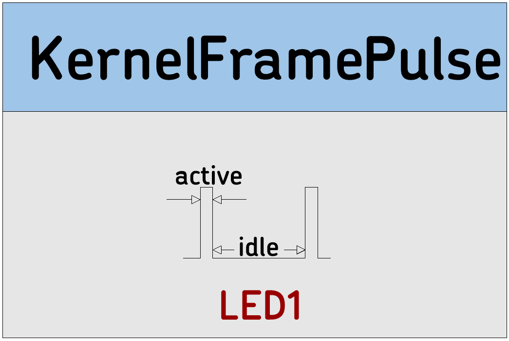

# KernelFramePulse

Configures the nBlocksStudio Kernel to Indicate active and idle Kernel period on a Pin. The period of this signal is the Kernel Tick. The duty-cycle is the Kernel Duty Cycle for a Program. Represents the Microcontroller occupancy and is one of the indexes to measure the quality of any Program. Can be connected to Oscilloscope or an LED 

 

 *  Category: Kernel
 *  HAL: mbed
 *  Tested: with LPC1768
 *  Author: F. Cosentino

## Implementation details

This is a configuration Node without any connections

# Input/Output Connections

 *  No connections

## Node Parameters 
 *  PinName:  Pin to be used for Kernel Duty Cycle Indicator

## Usage example
[KernelFramePulse]  
[Other]-->[Other] 
